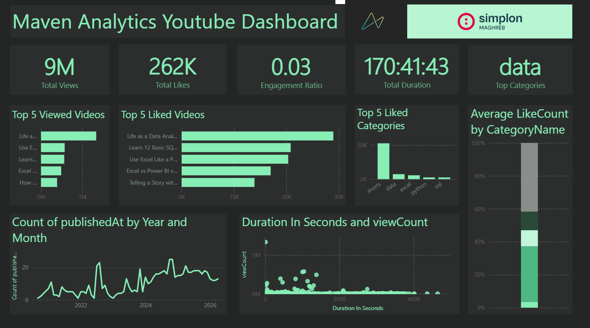

# Maven Analytics — YouTube Channel Dashboard

A full end-to-end data project: extraction from the YouTube Data API v3, transformation in Python and Power Query, and visualization in Power BI.



---

## Project Structure

```
├── datastore/
│   ├── channel_metadata.json   # Channel-level info (upload playlist ID, video count)
│   ├── videosIds.txt           # One video ID per line
│   ├── videos.json             # Raw video metadata (title, stats, duration)
│   └── videos_list.xlsx        # Cleaned export fed into Power BI
├── extract.py                  # YouTube API extraction pipeline
├── transform.ipynb             # Pandas transformation + Excel export
└── MavenAnalytics_Dashboard.pbix
```

---

## Pipeline

### 1. Extraction — `extract.py`

Three sequential steps, each gated by a file-existence check (idempotent — safe to re-run):

| Step | Function | API Endpoint | Output |
|------|----------|-------------|--------|
| Channel metadata | `get_channel_metadata()` | `channels` | `channel_metadata.json` |
| Video IDs | `get_videos_ids_list()` | `playlistItems` (paginated, 50/page) | `videosIds.txt` |
| Video details | `get_videos_metadata()` | `videos` (batches of 50) | `videos.json` |

Fields collected per video: `videoId`, `title`, `publishedAt`, `duration` (ISO 8601), `viewCount`, `likeCount`, `commentCount`.

Rate limiting is handled with `time.sleep` between paginated requests.

---

### 2. Transformation — `transform.ipynb`

- ISO 8601 duration (`PT1H3M22S`) → `HH:MM:SS` string via regex
- `publishedAt` timezone stripped (`tz_localize(None)`) for Power BI compatibility
- Output: `videos_list.xlsx`

**Power Query (inside Power BI):**
- Video titles contain YouTube hashtags (e.g. `#excel #sql`) — these are split and loaded into a dedicated dimension table
- A bridge table resolves the many-to-many relationship between videos and categories

---

## Data Model

```
CategoryDimTable
─────────────────
CategoryID   (PK)
CategoryName

        │  (1)
        │
VideoCategoryRelTable   ← bridge table
─────────────────────
VideoID      (FK → FactTable)
CategoryID   (FK → CategoryDimTable)
        │
        │  (many)

FactTable
──────────────────────
videoId      (PK)
title
publishedAt
duration     (HH:MM:SS)
viewCount
likeCount
commentCount
```

Relationship type: many-to-many between `FactTable` and `CategoryDimTable`, resolved through `VideoCategoryRelTable`.


---

## DAX Measures

| Measure | Logic |
|---------|-------|
| `Total Views` | `SUM(viewCount)` |
| `Total Likes` | `SUM(likeCount)` |
| `Total Comments` | `SUM(commentCount)` |
| `Total Videos` | `COUNTROWS(FactTable)` |
| `Total Duration` | Converts total seconds → `H:MM:SS` string via `INT / MOD` |
| `Engagement Ratio` | `(Likes + Comments) / Views` — channel-level |
| `Like Ratio` | `Likes / Views` |
| `Average LikeCount` | `AVERAGE(likeCount)` |
| `Average Duration` | `AVERAGE(duration)` |
| `Top Categories` | `ADDCOLUMNS` per category + `TOPN(1)` by engagement ratio → returns category name |

---

## Dashboard — Key Visuals

| Visual | Description |
|--------|-------------|
| KPI cards | Total Views, Likes, Engagement Ratio, Total Duration, Top Category |
| Top 5 Viewed Videos | Horizontal bar chart |
| Top 5 Liked Videos | Horizontal bar chart |
| Top 5 Liked Categories | Clustered bar chart by category |
| Avg LikeCount by Category | 100% stacked bar |
| Published At by Year/Month | Line chart — upload frequency over time |
| Duration vs ViewCount | Scatter plot — relationship between video length and views |


---

## Stack

- **Python** — `requests`, `pandas`, `python-dotenv`, `itertools`
- **Power Query** — hashtag extraction, category dim table
- **Power BI Desktop** — data model, DAX, visuals
- **YouTube Data API v3**